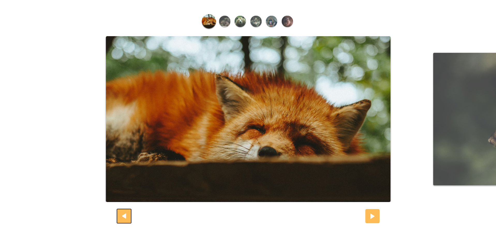
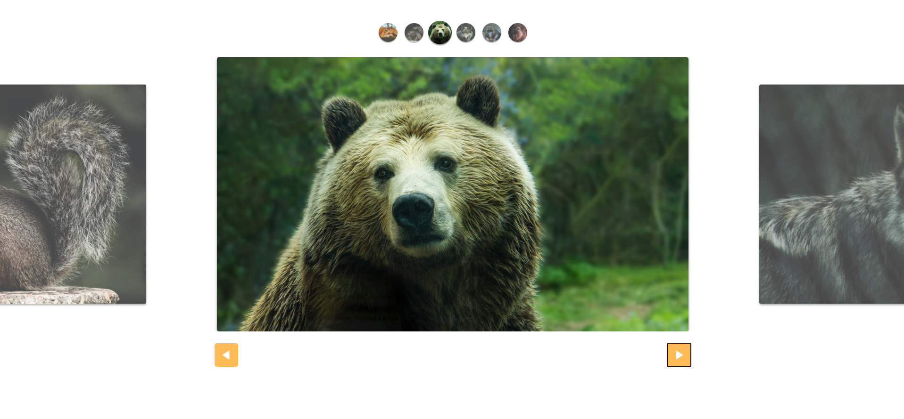

## 🚀 Sobre o projeto

Corousel feito em JS e CSS, para podendo passar a imagem arrastando ou clicando sobre as setas.

## 🚀 Começando

Essas instruções permitirão que você obtenha uma cópia do projeto em operação na sua máquina local para fins de desenvolvimento e teste.

### 📋 Pré-requisitos

Coisas você precisa para instalar o software e como instalá-lo :

```
GIT para colocar o projeto
```

### 🔧 Instalação

```
Clone ou baixe o ZIP do projeto
```

### Para executar :

```
Entre pasta do projeto e abra o arquivo index.html
```

## 🛠 💻 Para acessar o projeto funcional :

<br>


<p>

Clique aqui > [Carousel](https://carousel-com-js-samuelrrs.netlify.app/) 

<br>

<p>

## <h3> 🖼️ Layout</h3>

<br>

 
    <br>
 
    <br>


## 🛠️ Construído com

- [JS](https://developer.mozilla.org/pt-BR/docs/Web/JavaScript)
- [HTML](https://developer.mozilla.org/pt-BR/docs/Web/HTML)
- [CSS](https://www.w3schools.com/css/)


## ✒️ Autores

- **Desenvolvedor** - [Samuel Ribeiro](https://github.com/samuelrrs)

---

⌨️ por [Samuel Ribeiro](https://github.com/samuelrrs) 🚀
